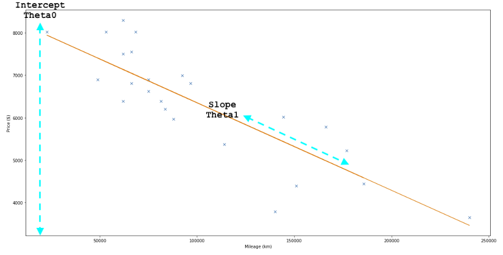

# ft_linear_regression

## 1. Project description

### 1.1 Objective

Aim of the project is to introduce you to the basic concept behind machine learning. For this project, you will have to create a program that predicts the price of a car by using a [linear function](https://en.wikipedia.org/wiki/Linear_function) train with a [gradient descent algorithm](https://en.wikipedia.org/wiki/Gradient_descent)

### 1.2 Linear regression model for predict a price

estimatePrice = Theta0 + (Theta1 * mileage)

### 1.3 Train model for solving unknown variables (Theta0 and Theta1)

tmpTheta0 = learningRate \* 1/m \* Σ(estimatePrice(mileage[i] - price[i]))
tmpTheta1 = learningRate \* 1/m \* Σ(estimatePrice(mileage[i] - price[i])) * mileage[i]

### 1.4 Input for training model

Content of a dataset file is used for calculating unknown variables. The file includes 24 Mileage/Price pairs.

## 2. Prestudy

I started to learn these three subjects to get overall understanding about the algorithms which are required to execute the project successfully:

- [Linear regression](https://en.wikipedia.org/wiki/Linear_regression#:~:text=In%20statistics%2C%20linear%20regression%20is,as%20dependent%20and%20independent%20variables\).&text=Such%20models%20are%20called%20linear%20models.)
- [linear function](https://en.wikipedia.org/wiki/Linear_function)
- [gradient descent algorithm](https://en.wikipedia.org/wiki/Gradient_descent)

## 3. What is [linear regression](https://en.wikipedia.org/wiki/Linear_regression#:~:text=In_statistics,_linear_regression_is,as_dependent_and_independent_variables\).&text=Such_models_are_called_linear_models.)

Linear regression is a linear approach for modelling the relationship between a scalar response and one or more explanatory variables (also known as dependent and independent variables). The case of one explanatory variable (which is valid in the project) is called [simple linear regression](https://en.wikipedia.org/wiki/Simple_linear_regression).

### 3.1 Visualization how linear regression line is iterated by using gradient descent algorithm.

**NOTE**: Click the picture to start video

## 4 Solution

### 4.1 Utilities

| Function name | similar function in python | Comments |
| :- | :- | :- |
| ft_matrix_dot_vector_double | nympy.dot() | |
| ft_matrix_multiply_vector_double | numpy.multiply | |
| ft_matrix_transpose | nympy.transpose | |
| ft_matrix_subtract_vector_double | nympy.subtract | |
| ft_matrix_sum | numpy.sum | |

### 4.2 Calculation of unknown variables

In this project gradient descent algorithm is used for calculating unknow variables (Theta0 and Theta1). Used formulas are described in chapeter 1.3. Value pairs (Mileage, Price) from the dataset file are used for calculation. Number of iteration loops is controlled by cost_limit parameter. Which means that iteration continues as long as calculatted cost (refer chapter 4.4) value differs more thatn given cost limit value.

### 4.3 Prediction

Theta0 and Theta1 values are used for price clculation (prediction). Mileage must be positive integer and predicted price is printed out if it is positive integer value. These limitations can be override by using cmd line argument -F.

### 4.4 Precision of an algorithm ([Coefficient of determination](https://en.wikipedia.org/wiki/Coefficient_of_determination))

Coefficient of determination is used for calculation of a precision of the algorithmm (r2).

### 3.5 Implemented command line arguments

| Argument | Description |
| :-: | - |
| -h | Help printout |
| -f \<dataset file\> | Calculates unknown variables (Theta0 and Theta1) |
| -F | Allow calculation of negative input mileages and negative price results |
| -A \<learningRate\> | Learning rate (alpha) for calculating of unknown variables |
| -C \<cost limit\> | A cost limit. The limit is used for controlling number of iteration during calculating of unknown variables |
| -L \<logging level\>| A logging level is used for troubleshooting. Levels are from 0 to 4. TRACE, DEBUG, INFO, WARN and ERROR |
| -l | Print leaks, if any. Only in MAC-OS |

## 4 Lessons learned

### 4.1 Linear regression

### 4.2 Gradient descent

### 4.3 Coefficient of determination (r2)

### 4.4 Matrix clculation
